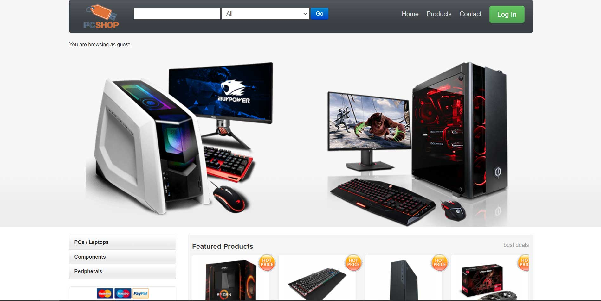

# PC Shop
> An online e-commerce web store built using PHP, MySQL and JS.
> 
> 

## Table of Contents
- [PC Shop](#pc-shop)
  - [Table of Contents](#table-of-contents)
  - [Technologies Used](#technologies-used)
  - [Features](#features)

## Technologies Used
- PHP
- MySQL
- JQuery
- Bootstrap

## Features
This website has all the required functions as an e-commerce web store. Here are the available features.
- Pages - Home, Products, Contact.
- Membership - Admin, guest user and authorized user.
- User Authentication - Register, login for website and admin panel.

Role based functionalities:
- Guest functions - View, search, filter, sort products.
- Admin functions - Create and delete data.

